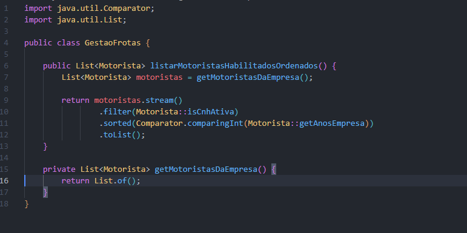
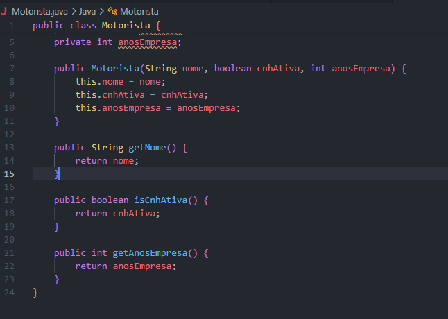

## Código modernizado

List<Motorista> motoristas = getMotoristasDaEmpresa();

List<Motorista> habilitados = motoristas.stream()
        .filter(Motorista::isCnhAtiva)
        .sorted(Comparator.comparingInt(Motorista::getAnosEmpresa))
        .toList();

## Relato do aprendizado

Aprendi que o Java moderno ajuda bastante a deixar o código mais simples de entender. Antes, era necessário criar uma lista separada, percorrer os motoristas manualmente e depois ordenar com um código maior. Com Stream, da pra ver o processo como uma sequência de passos: filtrar quem tem CNH ativa e depois ordenar pelo tempo de empresa. Também entendi melhor como o Optional pode ajudar a evitar problemas com valores nulos, mostrando que é muito importante estar antenado com as novas versões e atualizações das linguagens

## Prompt de desafio

Agora, explique-me: se eu quisesse que esse filtro também removesse motoristas que não possuem um Optional de seguro ativo, como eu alteraria essa Stream? Não me dê o código, explique-me a lógica.

## Captura de tela

